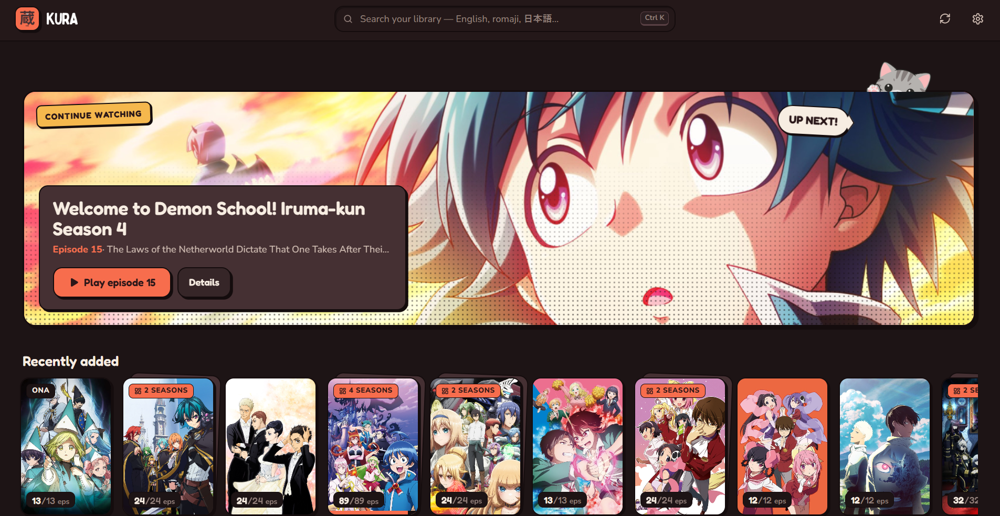
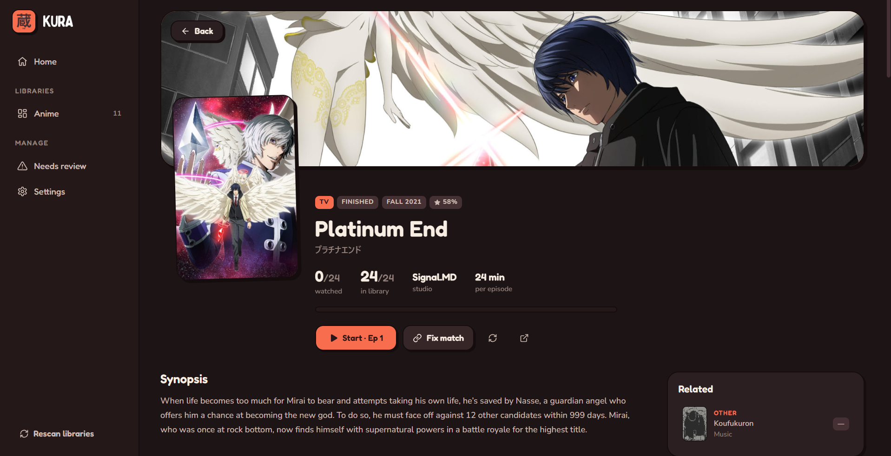
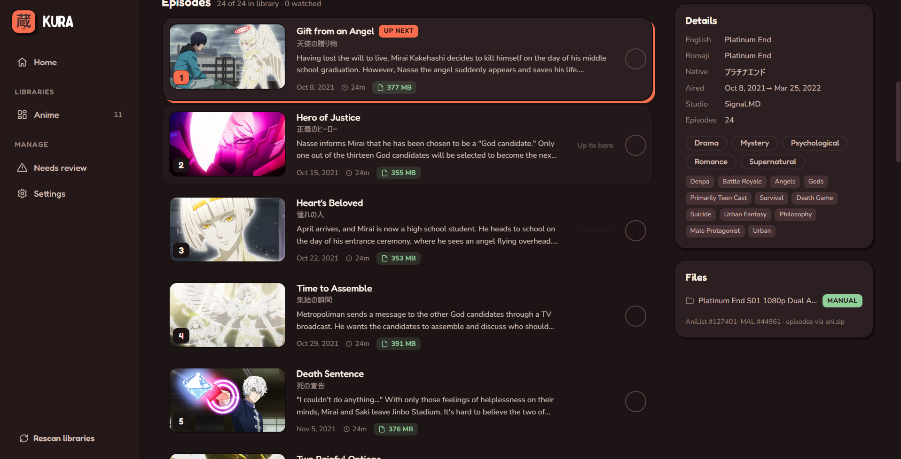

# Kura 蔵

<p align="center">
  
  <br>
  <strong>A local-first, manga-styled desktop anime media library.</strong>
  <br>
  <em>Current Release: <code>v0.3.2-alpha</code> · Built with AI assistance</em>
</p>

---

Point **Kura** at your local anime folders and it takes care of the rest: parses complex fansub release names, matches series to [AniList](https://anilist.co), pulls rich episode metadata and thumbnails via [ani.zip](https://api.ani.zip) (with [Jikan](https://jikan.moe) fallback), and organizes everything into an offline-ready, comic-inspired library interface.

---

## 📸 Screenshots

### Home & Library
A slim top bar with instant search from anywhere (`Ctrl K`), a comic-inspired "Continue watching" hero panel, recently added titles, and your library with multi-season shows neatly grouped into stacked cards:



### Cinematic Backdrop & Season Tabs
A widescreen cinematic backdrop, cover art overlay, airing and release metadata, watch progress, and seamless tabbed navigation across all seasons and movies in the franchise:



### Rich Episode Guides & Metadata
Individual episode thumbnails, Japanese and English titles, air dates, runtimes, file sizes, watch toggles, and detailed synopsis with genres, tags, and studio info:



---

## ✨ Features

### New in `v0.3.2-alpha`
- **Transparent ClearArt / Logos on Backdrops**: Displays high-resolution series typography wordmarks and ClearArt on the cinematic backdrop, powered by Fanart.tv and local folder artwork (`clearlogo.png` / `logo.png`).
- **Safe Metadata & Artwork Rebuild Tool**: In Settings, easily wipe and reconstruct local artwork and metadata caches from scratch while strictly preserving 100% of your watch history, progress, track preferences, and library folders.
- **Scanning Pipeline Overhaul & Stability**: Drastically improved scan reliability and concurrency, added strict external provider timeouts, eliminated main thread mutex contention, and streamlined franchise resolution.

### Highlights from `v0.3.1-alpha`
- **Plays in your own player**: [mpv](https://mpv.io), [VLC](https://www.videolan.org/vlc/), [MPC-HC / MPC-BE](https://github.com/clsid2/mpc-hc) and [Memento](https://github.com/ripose-jp/Memento) are detected automatically (or pick the program yourself). The system default player still works too.
- **Progress & resume**: Kura follows playback, remembers where you stopped, and resumes from there next time. Episode lists show how far into each episode you are.
- **Auto-marked watched**: An episode counts as watched once you pass 90% of it (adjustable in Settings), so skipping the ending still counts.
- **Autoplay next episode** *(off by default)*: When an episode ends, the next one you own starts in the same player window — including the first episode of the next season.
- **Audio & Subtitle Track Defaults**: Set your global preferences (e.g. Japanese audio + Japanese subtitles with English fallback, English dub with subtitles off, etc.) in Settings. Automatically passes track selection flags to mpv, Memento, and VLC. Custom track overrides can also be configured per anime directly on the series detail page.
- **Plex & Jellyfin folder support**: Robust matching for multi-season libraries organized by folders (`Season 1`, `Season 2`). Handles complex franchise bridges across OVAs, specials, and TV side-stories (*Slime*, *Date A Live*, *Full Metal Panic*).
- **Extras & Bonus videos**: Automatic classification and dedicated playback section for creditless openings (`NCOP`), endings (`NCED`), trailers, PVs, and bonus features without polluting episode tallies.
- **Cinematic Backdrop Header**: Expanded widescreen backdrop panel with gradient shade and layered poster artwork on anime detail pages.
- **New home page**: A comic-page “Continue watching” panel with one-click resume, plus “New episode” and “Finish this” panels above your library.
- **Top bar instead of a sidebar**: Search from anywhere (`Ctrl K`), scan progress, review queue and settings in one slim bar.
- **Automatic updates**: Kura checks GitHub for new versions on startup and can update itself in one click.

### Library
- **Intelligent Filename Parsing**: Handles real-world release formats, fansub group tags `[Group]`, scene conventions, `SxxEyy`, `- 05v2`, batch folders, multi-part titles (`Part 2`), OVA/SP/Movie markings, creditless OP/EDs (`NCOP`/`NCED`), and Japanese numbering (`第N話`).
- **Season & Sequel Chain Resolution**: Accurately maps absolute episode numbering (e.g. episode `35`) or multi-season releases to the correct sequel/prequel AniList entry.
- **Rich Episode Details**: Synopses, episode titles (English + Kanji/Kana), thumbnails, and air dates pulled from [ani.zip](https://api.ani.zip) with [Jikan](https://jikan.moe) fallback.
- **Local-First & Offline Ready**: All metadata and cached artworks are saved locally using SQLite. Fast, lightweight, and works without an internet connection once scanned.
- **Review Queue & Manual Matcher**: "Needs review" queue and manual "Fix match" search modal for any unrecognized or ambiguous files.
- **Watched Progress Tracking**: Mark episodes as watched individually or in bulk ("Up to here"), with active progress bars on anime cards.
- **Grouped Seasons**: AniList splits every season, movie and OVA into its own entry; Kura stitches them back into one card per show with season tabs (switchable to separate cards in Settings).

---

## 🗺️ Roadmap (Upcoming Features)

- [x] **External Player Integrations**: mpv, VLC, MPC-HC/BE and Memento, with watch-time and completion detection via player IPC.
- [x] **Subtitles & Audio Track Defaults**: Configurable default audio language (e.g. Japanese vs. English dub) and subtitle preferences automatically passed to players on launch, with per-show overrides.
- [x] **Auto-Update**: Cryptographically signed in-app updates from GitHub Releases.
- [x] **Cross-Platform Release Automation**: Automated CI/CD builds for Windows (`.exe`/`.msi`), macOS (`.dmg`), and Linux (`.deb`/`.rpm`/`.AppImage`) via GitHub Actions.
- [x] **Manga Mode (Light Theme)**: High-contrast sumi ink on warm manga paper with authentic Japanese vermilion stamp accents (`#e53935`).
- [ ] **Priority Artwork Engine & ClearLogos**: Strict priority pipeline (`Local > Fanart.tv/ani.zip > AniList`) with official transparent anime title logos floating over 1080p backdrops.
- [ ] **Discord Rich Presence (RPC)**: Live watching activity on your Discord profile with anime title, episode number/title, live remaining time bar, and cover thumbnails.
- [ ] **Folder Watcher / Auto-Rescan**: Automatic background scanning triggered when new episode downloads complete in monitored directories.
- [ ] **Rich Cast & Staff Metadata**: Character voice actors (Japanese seiyuu & English cast with character portraits), director, series composition, music composers, and key studio staff on the anime detail page.
- [ ] **AniList & MyAnimeList Account Sync**: OAuth2 login, list import, and safe two-way watch progress synchronization (ensures local and remote progress never accidentally regress).
- [ ] **Japanese Immersion & Yomitan Subtitle HUD**: Lightweight, instant-load alternative to Memento — real-time mpv subtitle streaming + transparent overlay with hoverable Yomitan dictionary lookups (readings, pitch accent, definitions).
- [ ] **Advanced Filtering & Search**: Filter by genres, tags, studios, release seasons, voice actors, and airing status.
- [ ] **Library Export / Backup**: Portable JSON backup for watch history, track preferences, and custom matches.

> For the detailed phase-by-phase implementation specifications and engineering checklists, see **[TODO.md](TODO.md)**.

---

## 📦 Download & Installation

### Releases
Download pre-compiled packages from the **[GitHub Releases](https://github.com/wantingCat/kura/releases)** page:
- **Windows**: `.exe` (setup wizard, recommended) or `.msi`
- **macOS**: `.dmg` — `aarch64` for Apple Silicon (M1 and newer), `x64` for Intel Macs
- **Linux**: `.deb` (Ubuntu / Debian), `.rpm` (Fedora / openSUSE) or `.AppImage` (any distro)

From `v0.2.0` on, Kura updates itself: when a new version is out you'll see a banner with an **Update & restart** button (you can turn the check off in Settings). On Linux, self-update works with the `.AppImage`; `.deb` / `.rpm` installs are updated by downloading the new package.

> [!NOTE]
> Alpha builds are not code-signed yet. On **Windows**, SmartScreen may say "Windows protected your PC" — click **More info → Run anyway**. On **macOS**, right-click the app and choose **Open** the first time.

---

## 🛠️ Building from Source

### Prerequisites
- [Node.js](https://nodejs.org) 20+
- [Rust](https://rustup.rs) (stable)
- OS-specific [Tauri v2 prerequisites](https://v2.tauri.app/start/prerequisites/) (on Windows: C++ Build Tools & WebView2)

### Setup & Run
```sh
# Install dependencies
npm install

# Start development app with hot reload
npm run tauri dev
```

### Useful Commands
| Command | Purpose |
| --- | --- |
| `npm run check` | Svelte & TypeScript diagnostics |
| `cargo test --lib` (in `src-tauri`) | Filename parser & matcher unit tests |
| `npm run tauri build` | Build optimized production executable and installers |

---

## 🧱 Tech Stack

- **Desktop Framework**: [Tauri v2](https://v2.tauri.app)
- **Backend / Core**: Rust (`rusqlite`, `reqwest`, `tokio`, custom filename regex parser)
- **Frontend**: [SvelteKit](https://kit.svelte.dev) (Svelte 5, static SPA adapter)
- **Language**: TypeScript & Rust
- **Styling**: Vanilla CSS (comicbook / pop dark aesthetic)
- **Metadata Sources**: [AniList GraphQL API](https://anilist.gitbook.io/anilist-apiv2-docs), [ani.zip](https://api.ani.zip), [Jikan / MAL](https://jikan.moe)

---

## 📄 License

This project is licensed under the [GNU General Public License v3.0 or later (GPL-3.0-or-later)](LICENSE).
Forks, derivative works, and redistributed versions must remain free and open source under the same license.
